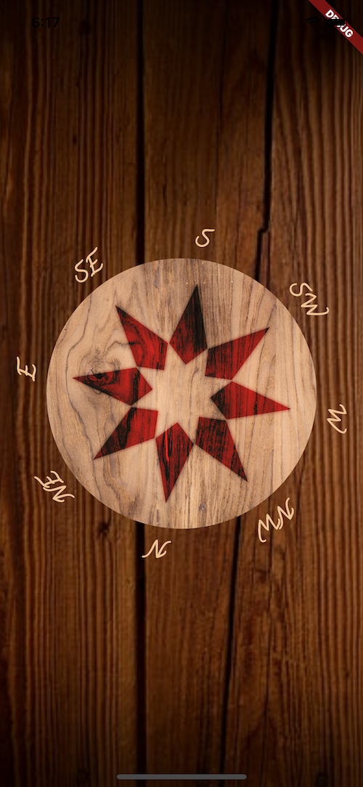

# Compass

This app simulates a compass and was created specifically for the Flutter Create challenge.

## Using it

Run the application preferably on a physical device. It uses the magnetometer's
output to animate the rotation. It depends on [aeyrium_sensor](https://pub.dartlang.org/packages/aeyrium_sensor). 

Dart file size measured was 5098 bytes. Some variable names, commas and override
annotations where shortened or removed to reduce the file size.
Everything was done on a single file to reduce size.

There is a easter bird hidden in there :)
